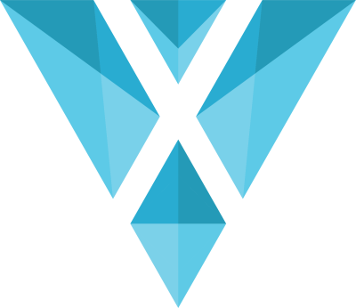
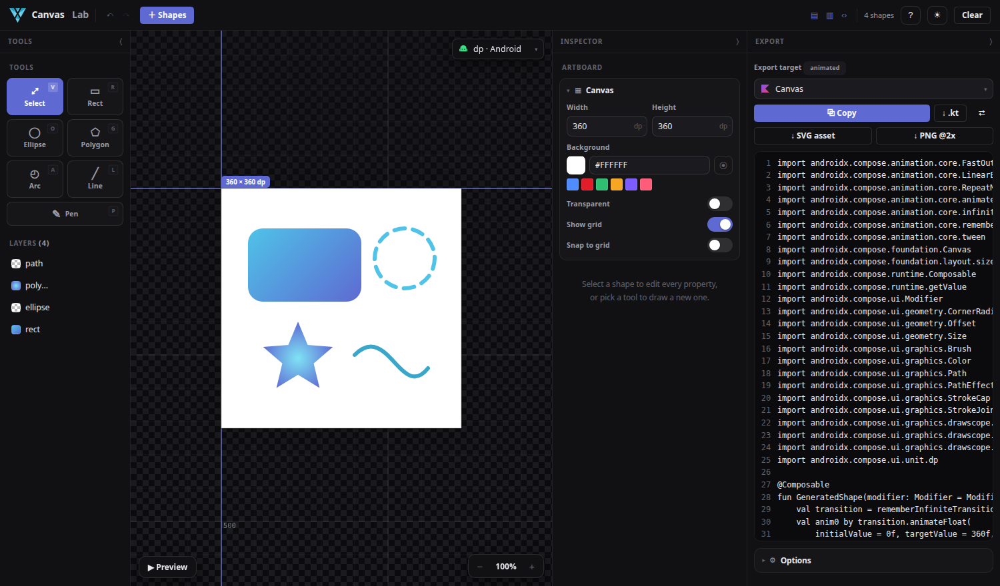
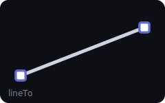
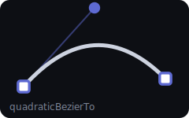
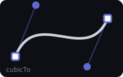

<div align="center">



# Canvas Lab

**Draw shapes visually → copy production-ready code.**
Jetpack Compose · SVG · Android VectorDrawable · React · HTML Canvas — plus SVG/PNG assets.

<sub>by [Vexora](https://vexora.in)</sub>




</div>

## What it does

Design on an infinite **dp** graph and export the exact same drawing to whatever stack you ship on — no redrawing by hand.

- 🟦 **Shapes** — rectangle (per-corner radius), ellipse, line, **bezier pen**, polygon / star, arc / pie
- 🎨 **Full paint** — solid + linear / radial / sweep gradients, stroke cap / join / dash, blend modes, opacity, rotation
- 🎬 **Animations** — spin · pulse · fade · dash-flow · trace · float · wiggle → real `rememberInfiniteTransition`, with live preview
- 🔎 **Shape library** — 30+ ready shapes, searchable
- 🧲 **Pro canvas** — infinite graph grid, zoom-to-cursor, pan, snapping, undo/redo, autosave, right-click menu
- 📐 **dp / sp / px / pt** units and a **fit-parent** (responsive) export so it scales on device

## Run

```bash
npm install
npm run dev        # http://localhost:5173  (LAN-exposed)
npm run build      # type-check + production build
```

## The pen draws real Béziers

Each path segment becomes the right Compose `Path` call depending on its control handles:

| `lineTo` | `quadraticBezierTo` | `cubicTo` |
|:---:|:---:|:---:|
|  |  |  |
| corner point | one control handle | two handles (click-drag) |

Click = corner · click-drag = curve · click the first point or `Enter` to finish · `⌫`/`Ctrl+Z` removes the last point.

## Shape library


## Export targets

| Platform | Targets |
|---|---|
| **Jetpack Compose** | `Canvas` DrawScope (+ animations) · `ImageVector` |
| **Android** | VectorDrawable XML |
| **Web** | SVG (full gradients) · React (inline SVG) · HTML Canvas (`Path2D`) |
| **Assets** | `.svg` download · `.png @2x` |

Gradients export fully to SVG/React; other targets fall back to solid. Animations export in Compose Canvas.

## Animations

| Preset | Compose output |
|---|---|
| Spin | `rotate()` + `animateFloat` 0→360 |
| Pulse / Float / Wiggle | reversing `scale()` / `translate()` / `rotate()` |
| Fade | animated `alpha` |
| Dash flow | animated `dashPathEffect` phase |
| Trace | draw-on via `PathMeasure.getSegment` |

Configure duration, delay, easing and repeat (loop / reverse / once); press **Preview** to play on the canvas.

## Tech

React 19 · TypeScript · Vite · [Konva](https://konvajs.org) (canvas) · [Zustand](https://github.com/pmndrs/zustand) (state). No backend — everything runs in the browser and autosaves locally.

## Architecture

The editor and the code generators never talk directly — they share one normalized **Shape Model** (`src/model/shapes.ts`). Adding an export target is one file in `src/codegen/`; adding a shape is one entry in the model rendered by `Editor.tsx` and handled by each generator.

## License

[MIT](LICENSE) © [Vexora](https://vexora.in)
